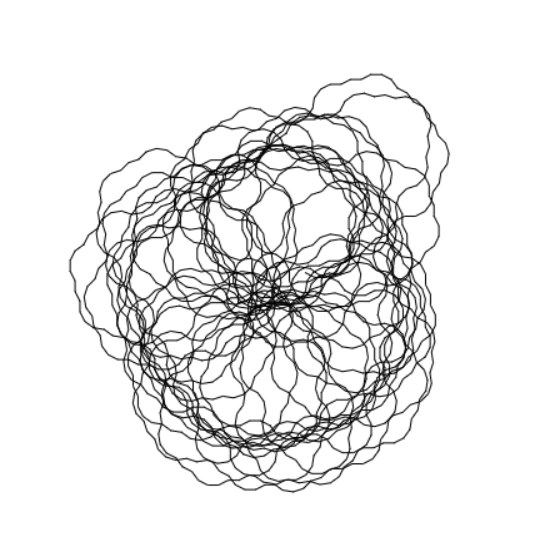
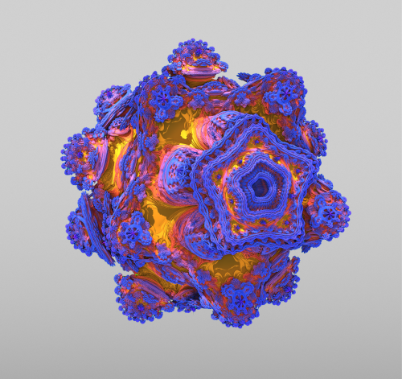

 
# Basics and related work

## Definition of Generative Art

If you search for definition for Generative Art, you can find several definitions. For this thesis, the definition of Philip Galanter is used:

"Generative Art refers to any art practice where the artist uses a system, such as a set of natural language rules, a computer program, a maschine, or other procedural invention which is set to into motion with some degree of autonomy contributing to or resulting in a completed work of art"

What is interesting about this definition is that it does not limit generative art to computers that generate images.

## Techniques

In the following, the most used techniques for Generative Art will be discussed. Most of these techniques are inspired by nature laws or mechanics. For example the L-system or the Lindenmayer system is a formal grammar and a string rewriting system that generates fractals, trees and plants. It was first described by the Hungarian-born US mathematician Aristid Lindenmayer in 1968. Lindenmayer's system was originally intended to model the growth processes of plant cells. The formalism has been used to generate fractals.

Research shows that the most used techniques for Generative Art are based on Genetic Algorithmes. Most of the following algorithms are taken from the book "A field guide to genetic programming" by Riccardo Poli Nicholas Freitag MCPhee and William B. Langdon.

{ width=400px }  
Figure 1: Rendering of Generated Art based on the L-System using p5.js

### Fractals   

Fractals are objects with a very complex structure or shape that can be generated by a simple iterative algorithm. Fractals are commonly approximated by iterative methods. The term "fractal" was first used by the inventor Benoit Mandelbrot in his Book "The fractal geometry of nature". According to Mandelbrot, "Fractals are geometric objects usually studied in relation to the study of dynamical systems, of which self-similarity is a first typical characteristic".

Fractals are generated by self-similarity (similarity of parts to the whole). This self-similarity can be observed at different scales.

### The Mandelbrot set

The Mandelbrot set is an example of a fractal that can be generated by a simple iterative algorithm. This particular fractal is generated by iterating the following equation:

Where X is a complex number, z0 is a complex number and z is a complex number. The value of Z after each iteration is the result of the previous iteration, which means that the value of Z is a function of the value of Z. This process is iterated until a certain iteration count or a boundary condition is reached.

The process of generating a fractal from an iterative equation is called self-similar iteration. The Mandelbrot set is generated by iterating for an iteration count of about 100. The values for z are calculated using the above equation, and the resulting value of Z is checked against the boundary conditions. The boundary conditions are that if Z is greater than the boundary condition (z0) the iteration is skipped and if Z equals the boundary condition (z0) the iteration is repeated.

The boundary condition for the equation above is z0 = 0. This means that if the iteration results in a value for Z that is equal to zero, the iteration is repeated. This is why the Mandelbrot set is a fractal. The boundary condition can be changed to any value to make the Mandelbrot set of any size.

{ width=400px }  
Figure 3: Rendering of the mandelbrot set with p5.js

### Mandelbulb

The mandelbulb set is a higher resolution version of the Mandelbrot set. It is created by applying a different equation to the set of complex numbers.

The result is a 3D set of complex numbers. The following figure shows the result of applying the iterations to the set of numbers [-1.4, 1]x[-1.4, 1]. The result of applying the iterations is represented by a black point. The iterations will stop when the resulting point is very small.

{ width=400px }  
Figure 4: Rendering of a Mandelbulb using mandelbulb

### Cellular Automata

### Particle Systems

Systems that consist of many small objects ('particles') that are emitted from a source are called particle systems.

The behavior of the particles is governed by simple rules. The particle system can be seen as a particle pipeline. The result is a sequence of particles that can be used for modeling many phenomena.

### Noise Functions

The noise function has many different applications in creative coding. It is used for procedural textures, particle systems, and for defining probability distributions.

Noise functions are heavily used in creative coding when pseudo random numbers are needed. The perlin noise for example is a function that generates random numbers that resemble the noise in nature.

### Data driven 

Data driven approaches for Generative Art are used for creating art from data.

### Genetic Algorithms

Genetic Algorithms (GA) use the same principles as nature when it comes to evolution. A population of individuals is created and the individuals are evaluated and ranked. The best individuals are selected to breed and the offspring is created by applying a genetic operator. The offspring is again evaluated and the ranking is updated.

## Games, Movies and Music

The film industry uses so called "generative systems" to create their movies. These systems are used to create the whole movie from story to editing. Typical use cases for generative Systems in Games include: City generation, Player Generation and Dynamic Story lines. Generative Music

A generative music system is a computer system that can create musical pieces that are never heard before. These pieces are typically quite short, but they can be combined to create longer pieces.

There are many different ways to create a generative music system. One popular approach is to use a Markov chain. A Markov chain is a system where the next state is determined by the current state, but not by the previous states. This approach can be used to create pieces that are never heard before, but that still sound like they are part of a larger piece.

Another popular approach is to use a genetic algorithm. A genetic algorithm is a system where pieces are created by combining different parts of other pieces. This approach can create pieces that are never heard before, and that sound very different from each other.

## Algorithmic Art

Algorithmic or Computer Art is created by a computer program for the purpose of being exhibited as art. It is a genre of art in which the artist is an algorithm. The algorithm is usually more complex than those used to generate patterns and pictures in computer animation, but the defining features of the genre are that the output of the algorithm is exhibited in a gallery, and that the algorithm is not intended to be comprehensible to human viewers.

The term was coined by Roy Ascott in 1986, who then proceeded to found the Algorithmic Arts Society.

Algorithmic art was initially developed by artists associated with the algorithmic and generative art communities. Some examples of early algorithmic art include:

The most famous generative art program is probably "AARON" by Harold Cohen of the University of California, and the "Cypher" program by Barry Truax, who is often considered the father of computer art.

In the early 2000s, the genre began to be adopted by mainstream video game companies and art institutions. For example, "Proteus" was an experimental game developed by Ed Key and David Kanaga and released in 2013 by Key in conjunction with the show "Sound States: The Art of Video Games" at London's Barbican Centre. The art in the game was generated by a computer program that generates fictional flora and fauna and changes the player's surroundings

In the mid-2000s, after about a decade of popular video games being created using the same technology that drives films, television series and cartoons (i.e. 3D rendering and CGI), a few companies began looking towards the video game industry's roots, and towards the arts, in search of new ideas which could be used to improve video games. In 2012, Nintendo released "Pikmin 3", a game which features an artist protagonist and that allows players to paint their surroundings. The same year, Electronic Arts released "FIFA 13", which allows players to control a virtual ball with the gamepad, moving it around and painting it with the controller's buttons, and then use the ball to play a game of football. "FIFA 13" was not the first game to allow players to control a virtual ball, but it was the first to allow players to paint the ball.

In 2013, the art and technology magazine "Wired" named "FIFA 13" and "Proteus" among the five most important art projects of the year, alongside "Videogames For Artists" (a game development competition hosted by the Tate Museum and the Tate Britain), "Play Me, I'm Yours", a series of playable pianos located in public spaces in the UK, and "The Art Game", a board game created by artists and designers in collaboration with the Museum of Modern Art in New York.

## Generative Art

Generative Art is not only created by computers but also

by humans. And some artists have also found a way to generate art by playing a computer game.

Generative Art is a form of art that can be generated by computers.

In the early 1960s, computer art was created by direct manipulation of a computer’s memory. Programs were written to randomly populate the memory with numbers, and then a program would be written to generate an image by controlling how the pixels could be modified.

The first generative art program was created in 1966 by Brion Gysin, a Beat author and artist from New York. He created the program to explore the potential of computers in art.

Generative Art is often created by a jitterbug program, which is a more complex method of randomizing pixels. Both the jitterbug and data randomization are used to create the randomness in Generative Art.

A jitterbug program is an algorithm that is used to create randomness in Generative Art. It is a type of recursive algorithm that uses a few simple rules to generate a larger dataset. The algorithm can be thought of as a combination of a loop and a conditional statement.

The jitterbug algorithm runs in one of two modes: "forward" and "reverse". In the forward mode, the program will start from the first element in a dataset and apply a series of rules to that data. In the reverse mode, the program will start from the last element of the dataset, apply rules to it, and then go to the previous element, and so on.

The p5.js framework is widely used for web-based generative systems. This framework is based on processing, a programming language that makes it easy to create shapes, patterns and colors generatively. Ultimately, a generative system is not dependent on the programming language or framework, it can be created with almost any programming language/framework. In this thesis I will use Unity3D which simplifies processes like rendering, analysis and management.

## Randomness

Different forms of randomness include:

Pseudo-randomness

Pseudo-randomness is a form of randomness that approximates the properties of randomness. It is often implemented by a deterministic algorithm that generates numbers according to a (pseudo-) random number generator algorithm. In some cases the algorithm can be made to have the same general properties as a random one, such as being unbiased.

For example, one can choose a random number in the range 0–1, by generating a random integer in the range 1–n. This works well if n is large, but will not work well for small values of n.

A better algorithm is to generate a random number in the range 0–1 by generating a random fraction x in the range 0–1 and then generating x times a random number in the range 0–n. This way one can generate random numbers for any n.

The following pseudocode shows how this can be done in one line of Python:

def random_number(n): return random() \* n

This is a (pseudo-) random number generator that produces numbers that are distributed uniformly.

This method is simple and works well in Python, but the function random() is not a true RNG. For example, in C++, the function rand() returns a number in the range 0–1. In fact, the Python version of the code uses this.

There is one major problem with the above method: it is not reproducible. That is, if you run the program twice, you will not get the same ‘random’ number twice. This is not a problem for many applications, but it is a problem for cryptography.

The Perlin noise is another way of creating randomness. The Perlin noise is based on the idea of creating a smooth “random” function. The following Python code uses the Perlin noise to generate a smooth “random” function.

def noise(x, y, z): n = 2048 # number of noise samples x = x _ 10 # scale to [0,1] y = y _ 10 # scale to [0,1] z = z \* 10 # scale to [0,1] return [x, y, z]

This is a (pseudo-) random function that produces numbers that are distributed uniformly.

Randomness from physical systems

Randomness can also be obtained from physical sources. Many of these methods are often also called “noise” and are used in simulations of natural systems.

For example, consider a marble rolling on a flat surface. If you measure the motion of the marble, it will seem to be determined, but if you measure the marble at a larger scale, the trajectory of the marble will seem to be random. This is because at a larger scale, the forces of the rebound of the surface will be averaged out and will no longer be visible.

Another example is the radioactive decay of an atom. The decay process is completely determined by the laws of physics, but the time of the decay is random.

One can also use the thermal noise of a resistor. The thermal noise is formally described by the following equation:

where k is Boltzmann’s constant and T is the absolute temperature.

Randomness from humans

Humans are often also an important source of randomness. A human-generated random number can be obtained for example by flipping a coin. The probability for a head or a tail is 50%, which makes the outcome of the coin flip random.

Another way is to use dice to generate randomness. A dice has six sides and each side has a number. If you roll the dice many times, the numbers will show up in a random order. In fact, there are 6! possible outcomes of a dice roll.

There are two interesting things about dice. First, if you roll a dice twice, the outcome will be the same. Second, if you roll two dice several times, the outcomes of the dice will be distributed evenly.

## Related Art movements
