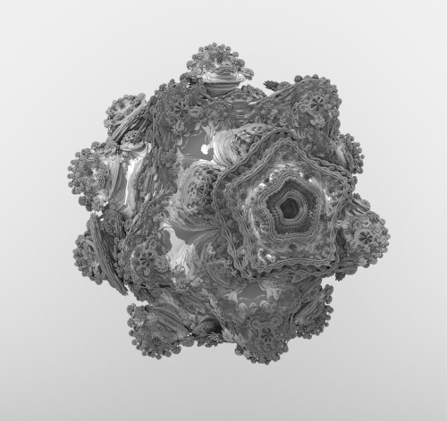
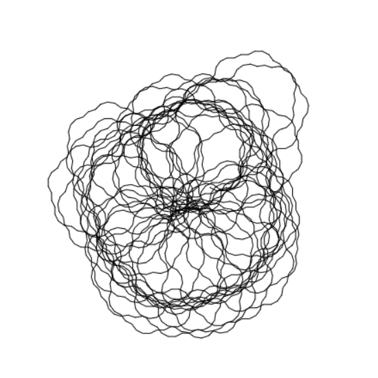

 
# Generative Art

## Definition of Generative Art

If you search for definition for Generative Art, you can find several definitions. For this thesis, the definition of Philip Galanter is used:

"Generative Art refers to any art practice where the artist uses a system, such as a set of natural language rules, a computer program, a maschine, or other procedural invention which is set to into motion with some degree of autonomy contributing to or resulting in a completed work of art"

What is interesting about this definition is that it does not limit generative art to computers that generate images.

## Techniques

In the following, the most used techniques for Generative Art will be discussed. Most of these techniques are inspired by nature laws or mechanics. For example the L-system or the Lindenmayer system is a formal grammar and a string rewriting system that generates fractals, trees and plants.
Most of the generative techniques can be categorized by predictable and non predictable execution. This distinction is important because it relates to the ability of the techniques to leverage the re-use of the code. The techniques based on randomness or unpredictable execution are not re-usable because they are not predictable and the same result cannot be obtained in a different context, while the techniques based on an algorithm or known pattern can be re-used in different contexts as long as the input and the external environment are the same.

The algorithms based on randomness are not re-usable because they depend on context and the same code will not work in different contexts. For example, the genetic algorithm uses randomness and some kind of function to optimize a value. This function depends on the context and it would not converge into the same result if the input data is different. For example, if someone wants to use a genetic algorithm to solve a new problem, he needs to create a new code and hope to get the same result, but this is not guaranteed.

The algorithms based on algorithms are re-usable because they are predictable and the user can get the same results in different contexts. For example, the analogical reasoning generates a solution based on a known analogy, and the user can use the same code in different contexts.

Research shows that most Generative Art algorithms are based on Genetic Algorithms. This is a class of Evolutionary Algorithms that grow a population of possible solutions to a problem and then evaluate these solutions to determine the quality of each. The best solutions are then allowed to “survive” to the next generation. These methods create the most visually pleasing results, but pose some challenges for the artist in the form of complexity and limits on the results.

Artists have developed their own methods for Generative Art, which tend to be more flexible and accessible to the user. The most commonly used algorithms are Cellular Automata, Rule 30, Reaction-Diffusion, and Perlin Noise.

### Fractals   

Fractals are objects with a very complex structure or shape that can be generated by a simple iterative algorithm. Fractals are commonly approximated by iterative methods. The term "fractal" was first used by the inventor Benoit Mandelbrot in his Book "The fractal geometry of nature". According to Mandelbrot, "Fractals are geometric objects usually studied in relation to the study of dynamical systems, of which self-similarity is a first typical characteristic".

Fractals are generated by self-similarity (similarity of parts to the whole). This self-similarity can be observed at different scales.

{ width=250px }

\pagebreak

### The Mandelbrot set

The Mandelbrot set is an example of a fractal that can be generated by a simple iterative algorithm. This particular fractal is generated by iterating the following equation:

Where X is a complex number, z0 is a complex number and z is a complex number. The value of Z after each iteration is the result of the previous iteration, which means that the value of Z is a function of the value of Z. This process is iterated until a certain iteration count or a boundary condition is reached.

{ width=400px }  
\pagebreak

### Mandelbulb

The Mandelbulb is the 3D analogue of the Mandelbrot set. It is created by applying a different equation to the set of complex numbers.  It is a 3D space filled with tiny Mandelbrot sets.

The result is a 3D set of complex numbers. The following figure shows the result of applying the iterations to the set of numbers [-1.4, 1]x[-1.4, 1]. The result of applying the iterations is represented by a black point. The iterations will stop when the resulting point is very small.

Just like the Mandelbrot set, the Mandelbulb is defined by a simple recurrence; but in 3D.

A point (x,y,z) is in the Mandelbulb set if (and only if) the following formula is satisfied:

f(z) = z^2 + c.

Where: f(z) is the iteration and c is a constant.

The Mandelbulb is computed by solving the 3D recurrence. The Mandelbulb itself is not the result, the result is a 3D grid of points (x,y,z) which are the locations of the Mandelbulb set. These points can be plotted to create the image of the Mandelbulb.

{ width=250px }

\pagebreak

### L-systems

The lindenmayer system is a method of describing the production of shape and color in plants and animals. The lindenmayer system is like a language, with symbols that have a meaning. It is also like a code, in which the symbols have no meaning until they are decoded. The lindenmayer system was invented by the Hungarian, Aristid Lindenmayer, in 1968.

Lindenmayer made two important discoveries. The first was that any object, such as a plant, or an animal, or a human, or a building, or a machine, or a river, can be described in terms of how it is put together from a few basic elements. The second discovery was that the way the basic elements are put together can be described using a language of symbols that have a simple meaning.

If you do not know the meaning of the symbols, but you do know the language, then you can decode the message contained in the symbols to see what the object really looks like.

Lindenmayer noticed that although the world is complex, it is possible to describe the world in terms of the repetition of a few basic elements, or shapes. So, for example, if you look at a plant, then there are a few basic shapes that make up the plant.

These basic shapes are of different types. For example, there are linear shapes, such as straight lines, curved lines, and circles. There are also looping shapes, such as bends and corners. There are branching shapes, such as forks and branches. And there are some other shapes that do not fit neatly into any of these categories.

{ width=250px }
\pagebreak

### Cellular Automata

Cellular Automata consists of a grid of cells and each cell has some state. The cells can change state according to some rule. For example, a cell could be black red or blue. There are several cellular automata rules which are used:

In the book "a new kind of science", Stephen Wolfram introduces four classes for cellular automata. The first class has the highest complexity which requires the most amount of steps to reach a stable state. The next class has a lower complexity, and so on.

Conway's Game Of Life is one example of this. It is a cellular automata which has a complexity of 2. It has the following rules:

* Any live cell with fewer than two live neighbours dies as if by loneliness.

* Any live cell with two or three live neighbours lives on as if by reproduction.

* Any live cell with more than three live neighbours dies as if by overcrowding.

* Any dead cell with exactly three live neighbours becomes a live cell as if by reproduction.

The rules of this cellular automata eventually reach a stable state.

{ width=250px }

\pagebreak

### Particle Systems

Systems that consist of many small objects ('particles') that are emitted from a source are called particle systems.

The behavior of the particles is governed by simple rules. The particle system can be seen as a particle pipeline. The result is a sequence of particles that can be used for modeling many phenomena.

{ width=250px }

### Data driven 

Data Driven approaches for Generative Art try to get away from the need for human interaction by converting data into instructions for the model. Then the instructions are executed to draw the artwork. Data driven artworks follow a deterministic approach and are predictable.

{ width=250px }  

### Noise Functions

The noise function has many different applications in creative coding. It is used for procedural textures, particle systems, and for defining probability distributions.

Noise functions are heavily used in creative coding when pseudo random numbers are needed. The perlin noise for example is a function that generates random numbers that resemble the noise in nature.

One of the most important noise functions is the perlin noise. Out of frustration of machine like generated imagery, Ken Perlin developed the perlin noise in 1983. Perlin noise is a procedural texture, a type of gradient noise used by visual artists and musicians to achieve more realistic random functions. 

The creation of perlin noise is achieved through a process called turbulence (which can be described as a chaotic computation).

{ width=250px }  

\pagebreak

### Genetic Algorithms

Genetic Algorithms (GA) use the same principles as nature when it comes to evolution. A population of individuals is created and the individuals are evaluated and ranked. The best individuals are selected to breed and the offspring is created by applying a genetic operator. The offspring is again evaluated and the ranking is updated. This is the so called survival of the fittest. The outcome of a genetic algorithm is usually split into two parts: The genotype and the phenotype. The genotype is the description of the individual and the phenotype is the result of the evaluation. The algorithm is usually evaluated by the phenotype and not by the genotype. The phenotype is evaluated by a fitness function that returns a number between 0 and 1.

The fitness function is the most important part of the genetic algorithm. If it is not working well the genetic algorithm will not work well. The fitness function should be clear, meaningful and well defined. It should be clear, so that the programmer knows what it means. It should be meaningful so that it is a good way to evaluate the results. And it should be well defined so that it is mathematically defined and can be used in an automated fashion. The fitness function is described in a very general way. The programmer will have to fill in the details of how the fitness function is evaluated.

The fitness function is often used to evaluate the result of the algorithm and is used to determine the next generation. The better the fitness function is, the better results you can expect. The fitness function is often called the goal function. It is used to determine the goal of the algorithm.

{ width=250px }

\pagebreak

## Games, Movies and Music

The film industry uses so called "generative systems" to create their movies. These systems are used to create the whole movie from story to editing. Typical use cases for generative Systems in Games include: City generation, Player Generation and Dynamic Story lines. Generative Music

A generative music system is a computer system that can create musical pieces that are never heard before. These pieces are typically quite short, but they can be combined to create longer pieces.

There are many different ways to create a generative music system. One popular approach is to use a Markov chain. A Markov chain is a system where the next state is determined by the current state, but not by the previous states. This approach can be used to create pieces that are never heard before, but that still sound like they are part of a larger piece.

Another popular approach is to use a genetic algorithm. A genetic algorithm is a system where pieces are created by combining different parts of other pieces. This approach can create pieces that are never heard before, and that sound very different from each other.

## Algorithmic Art

Algorithmic or Computer Art is created by a computer program for the purpose of being exhibited as art. It is a genre of art in which the artist is an algorithm. The algorithm is usually more complex than those used to generate patterns and pictures in computer animation, but the defining features of the genre are that the output of the algorithm is exhibited in a gallery, and that the algorithm is not intended to be comprehensible to human viewers.

The term was coined by Roy Ascott in 1986, who then proceeded to found the Algorithmic Arts Society.

Algorithmic art was initially developed by artists associated with the algorithmic and generative art communities. Some examples of early algorithmic art include:

The most famous generative art program is probably "AARON" by Harold Cohen of the University of California, and the "Cypher" program by Barry Truax, who is often considered the father of computer art.

In the early 2000s, the genre began to be adopted by mainstream video game companies and art institutions. For example, "Proteus" was an experimental game developed by Ed Key and David Kanaga and released in 2013 by Key in conjunction with the show "Sound States: The Art of Video Games" at London's Barbican Centre. The art in the game was generated by a computer program that generates fictional flora and fauna and changes the player's surroundings

In the mid-2000s, after about a decade of popular video games being created using the same technology that drives films, television series and cartoons (i.e. 3D rendering and CGI), a few companies began looking towards the video game industry's roots, and towards the arts, in search of new ideas which could be used to improve video games. In 2012, Nintendo released "Pikmin 3", a game which features an artist protagonist and that allows players to paint their surroundings. The same year, Electronic Arts released "FIFA 13", which allows players to control a virtual ball with the gamepad, moving it around and painting it with the controller's buttons, and then use the ball to play a game of football. "FIFA 13" was not the first game to allow players to control a virtual ball, but it was the first to allow players to paint the ball.

In 2013, the art and technology magazine "Wired" named "FIFA 13" and "Proteus" among the five most important art projects of the year, alongside "Videogames For Artists" (a game development competition hosted by the Tate Museum and the Tate Britain), "Play Me, I'm Yours", a series of playable pianos located in public spaces in the UK, and "The Art Game", a board game created by artists and designers in collaboration with the Museum of Modern Art in New York.

## Generative Art

Generative Art is not only created by computers but also

by humans. And some artists have also found a way to generate art by playing a computer game.

Generative Art is a form of art that can be generated by computers.

In the early 1960s, computer art was created by direct manipulation of a computer’s memory. Programs were written to randomly populate the memory with numbers, and then a program would be written to generate an image by controlling how the pixels could be modified.

The first generative art program was created in 1966 by Brion Gysin, a Beat author and artist from New York. He created the program to explore the potential of computers in art.

Generative Art is often created by a jitterbug program, which is a more complex method of randomizing pixels. Both the jitterbug and data randomization are used to create the randomness in Generative Art.

A jitterbug program is an algorithm that is used to create randomness in Generative Art. It is a type of recursive algorithm that uses a few simple rules to generate a larger dataset. The algorithm can be thought of as a combination of a loop and a conditional statement.

The jitterbug algorithm runs in one of two modes: "forward" and "reverse". In the forward mode, the program will start from the first element in a dataset and apply a series of rules to that data. In the reverse mode, the program will start from the last element of the dataset, apply rules to it, and then go to the previous element, and so on.

The p5.js framework is widely used for web-based generative systems. This framework is based on processing, a programming language that makes it easy to create shapes, patterns and colors generatively. Ultimately, a generative system is not dependent on the programming language or framework, it can be created with almost any programming language/framework. In this thesis I will use Unity3D which simplifies processes like rendering, analysis and management.

## Randomness

Different forms of randomness include:

Pseudo-randomness

Pseudo-randomness is a form of randomness that approximates the properties of randomness. It is often implemented by a deterministic algorithm that generates numbers according to a (pseudo-) random number generator algorithm. In some cases the algorithm can be made to have the same general properties as a random one, such as being unbiased.

For example, one can choose a random number in the range 0–1, by generating a random integer in the range 1–n. This works well if n is large, but will not work well for small values of n.

A better algorithm is to generate a random number in the range 0–1 by generating a random fraction x in the range 0–1 and then generating x times a random number in the range 0–n. This way one can generate random numbers for any n.

The following pseudocode shows how this can be done in one line of Python:

def random_number(n): return random() \* n

This is a (pseudo-) random number generator that produces numbers that are distributed uniformly.

This method is simple and works well in Python, but the function random() is not a true RNG. For example, in C++, the function rand() returns a number in the range 0–1. In fact, the Python version of the code uses this.

There is one major problem with the above method: it is not reproducible. That is, if you run the program twice, you will not get the same ‘random’ number twice. This is not a problem for many applications, but it is a problem for cryptography.

The Perlin noise is another way of creating randomness. The Perlin noise is based on the idea of creating a smooth “random” function. The following Python code uses the Perlin noise to generate a smooth “random” function.

def noise(x, y, z): n = 2048 # number of noise samples x = x _ 10 # scale to [0,1] y = y _ 10 # scale to [0,1] z = z \* 10 # scale to [0,1] return [x, y, z]

This is a (pseudo-) random function that produces numbers that are distributed uniformly.

Randomness from physical systems

Randomness can also be obtained from physical sources. Many of these methods are often also called “noise” and are used in simulations of natural systems.

For example, consider a marble rolling on a flat surface. If you measure the motion of the marble, it will seem to be determined, but if you measure the marble at a larger scale, the trajectory of the marble will seem to be random. This is because at a larger scale, the forces of the rebound of the surface will be averaged out and will no longer be visible.

Another example is the radioactive decay of an atom. The decay process is completely determined by the laws of physics, but the time of the decay is random.

One can also use the thermal noise of a resistor. The thermal noise is formally described by the following equation:

where k is Boltzmann’s constant and T is the absolute temperature.

Randomness from humans

Humans are often also an important source of randomness. A human-generated random number can be obtained for example by flipping a coin. The probability for a head or a tail is 50%, which makes the outcome of the coin flip random.

Another way is to use dice to generate randomness. A dice has six sides and each side has a number. If you roll the dice many times, the numbers will show up in a random order. In fact, there are 6! possible outcomes of a dice roll.

There are two interesting things about dice. First, if you roll a dice twice, the outcome will be the same. Second, if you roll two dice several times, the outcomes of the dice will be distributed evenly.

\pagebreak
