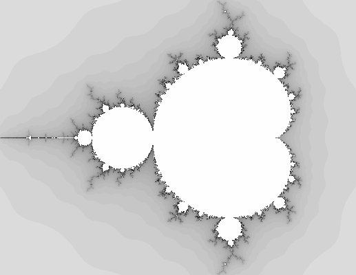

# Generative Systems

## Algorithmic Art

Algorithmic or Computer Art is created by a computer program for the purpose of being exhibited as art. It is a genre of art in which the artist is an algorithm. The algorithm is usually more complex than those used to generate patterns and pictures in computer animation, but the defining features of the genre are that the output of the algorithm is exhibited in a gallery and that the algorithm is not intended to be comprehensible to human viewers.
The term was coined by Roy Ascott in 1986 [^5].
Algorithmic art was initially developed by artists associated with the algorithmic and generative art communities.

The most famous generative art program is probably "AARON" [^6] by Harold Cohen of the University of California and the "Cypher" [^7] program by Barry Truax, who is often considered the father of computer art. In the early 2000s, the genre began to be adopted by mainstream video game companies and art institutions. For example, "Proteus" [^8] was an experimental game developed by Ed Key and David Kanaga and released in 2013 by Key in conjunction with the show "Sound States: The Art of Video Games" at London's Barbican Centre. The art in the game was generated by a computer program that generates fictional flora and fauna and changes the player's surroundings.
In the mid-2000s, after about a decade of popular video games being created using the same technology that drives films, television series, and cartoons (i.e., 3D rendering and CGI), a few companies began looking towards the video game industry's roots, and towards the arts, in search of new ideas which could be used to improve video games. In 2012, Nintendo released "Pikmin 3" [^9], a game that features an artist protagonist and that allows players to paint their surroundings. 

[^9]:https://www.ign.com/articles/2012/06/05/e3-2012-flying-pink-pikmin-join-pikmin-3
[^8]:https://gamasutra.com/view/news/39419/Road_to_the_IGF_Key_and_Kanagas_Proteus.php
[^7]:https://www.jstor.org/stable/1576078
[^6]:http://www.aaronshome.com/aaron/index.html
[^5]:https://alien.mur.at/rax/UBIQUA/index.html

## Generative Art

Generative Art is not only created by computers but also by humans. Some artists have also found a way to generate Art by playing computer games.

In the early 1960s, computer art was created by directly manipulating a computer's memory. Programs were written to populate the memory with numbers randomly, and then a program would be written to generate an image by controlling how the pixels are modified.

The first generative art program was created in 1965 by Ness [CITE], a Beat author and artist from New York. He created the program to explore the potential of computers in Art. Generative Art was often created by a jitterbug program, a more complex method of randomizing pixels. The jitterbug and data randomization is used to create randomness in Generative Art. It is a recursive algorithm that uses a few simple rules to generate a larger dataset. The algorithm can be thought of as a loop and a conditional statement.

The jitterbug algorithm runs in two modes: "forward" and "reverse." In the forward mode, the program will start from the first element in a dataset and apply a series of rules to that data. In the reverse mode, the program will start from the last element of the dataset, apply rules to it, go to the next element, and so on.

The p5.js [^10] framework is widely used for web-based generative systems. This framework is based on processing, a programming language that makes it generatively easy to create shapes, patterns, and colors. Ultimately, a generative system is not dependent on the programming language or framework; it can be created with almost any programming language/framework. In this thesis, Unity3D is used, which simplifies processes like rendering, analysis, and management.

[^10]: See 6.1.3

## Definition of Generative Art

If you search for a definition for Generative Art, you can find several definitions. For this thesis, the definition of Philip Galanter is used:
"Generative Art refers to any art practice where the artist uses a system, such as a set of natural language rules, a computer program, the machine, or other procedural invention which is set to into motion with some degree of autonomy contributing to or resulting in a completed work of art."
What is interesting about this definition is that it does not limit generative art to computers that generate images.

## Randomness

### Pseudo-randomness

Pseudo-randomness is a form of Randomness that approximates the properties of Randomness. It is often implemented by a deterministic algorithm that generates numbers according to a (pseudo-) random number generator algorithm. In some cases, the algorithm can be made to have the same general properties as a random one, such as being unbiased.

For example, one can choose a random number in the range *0–1* by generating a random integer in the range *1–n*. This works well if *n* is large but will not work well for small values of *n*.

A better algorithm is to generate a random number in the range *0–1* by generating a random fraction x in the range *0–1* and then generating *x* times a random number in the range *0–n*. This way, one can generate random numbers for any *n*.

### Randomness from physical systems

Randomness can also be obtained from physical sources. Many of these methods are often also called “noise” and are used in simulations of natural systems.

For example, the rolling of a  marble on a flat surface can be described as physics-based randomness. If the marble's motion is measured, it will seem to be determined, but if the same marble is measured at a larger scale, the trajectory of the marble will seem to be random [^11]. This is because, on a larger scale, the forces of the rebound of the surface will be averaged out and will no longer be visible.

Another example is the radioactive decay of an atom. The decay process is completely determined by the laws of physics, but the time of the decay is random [^12].

One can also use the thermal noise of a resistor to come up with a physics-based random value

[^12]:https://www.radiation-dosimetry.org/what-is-radioactive-decay-law-definition/
[^11]:http://www.karlsims.com/marbles/

### Randomness from humans

Humans are often also an important source of Randomness. A human-generated random number can be obtained, for example, by flipping a coin. The probability for a head or a tail is 50%, which makes the outcome of the coin flip random.

Another way is to use dice to generate Randomness. A dice has six sides, and each side has a number. If the dice is rolled many times, the numbers will show up in random order. In fact, there are 6! possible outcomes of a dice roll.

\pagebreak

## Games, Movies and Music

In the film industry Generative Systems are heavily used. These systems are used to create the whole movie, from story to editing. Whole scenes are generated, ranging from a large skyline of skyscrapers to other wordly alien planets. An example of this is Sky Captain and the World of Tomorrow. The movie Sky Captain and the World of Tomorrow [^13] is a movie that uses artificial intelligence to generate the whole video, with no one scene the same as the last. However staying true to the script of the artificial intelligence an ending was generated. This movie was a perfect example of how using a Generative System can go wrong, as the ending was so bad that it ruined the whole movie. 

Another example of a Generative System is the video game Spore [^14]. Spore is a video game where the player creates an organism, and then the player can control their organism, explore the world, and create new organisms with their unique body shape and behaviors. As well as this, the player can also create vehicles and buildings. The player also has to battle against other organisms, for example, for survival purposes. The Organisms evolve, as the player creates new DNA, which then allows the organism to be able to reproduce, but not only that, the new offspring can also be unique, this is because the offspring is created from a combination of its parent's DNA. The game also allows the player to explore a whole new planet, and there is a galaxy of planets that the player can explore. The player can also explore other planets through spaceships or build their spaceship. The video game has also been used as a learning tool for AI, as it is an excellent example of how a Generative System works and how it can be used in the future. 

A *generative music system* is a computer system that can create musical pieces based on rules. These pieces are typically relatively short, but they can be combined to create longer pieces. There are many different ways to create a generative music system. One popular approach is to use a Markov chain [^15]. A Markov chain is a system where the current state determines the next state but not the previous states. This approach can create pieces that are never heard before but still sound like they are part of a larger piece. Another popular approach is to use a genetic algorithm. A genetic algorithm is a system where pieces are created by combining different parts of other pieces. This approach can create pieces that are never heard before and sound very different.

Generative music systems have been used in several different areas. One important area is music composition. Many composers have used generative music systems to create new pieces of music. Another important area is music for games. Many games use generative music systems to create music for the game. This music is typically used to create music while the player is just moving around, waiting for something to happen, or just standing around. 

[^15]: https://brilliant.org/wiki/markov-chains/
[^14]: https://www.spore.com/
[^13]: https://www.imdb.com/title/tt0346156/

## Techniques

The most used techniques for Generative Art will be discussed in the following. Most of these techniques are inspired by nature laws or mechanics. For example, the L-system or the Lindenmayer [^16] system is formal grammar and a string rewriting system that generates fractals, trees, and plants. Most of the generative techniques can be categorized by predictable and nonpredictable execution. This distinction is important because it relates to the ability of the techniques to leverage the re-use of the code. The techniques based on randomness or unpredictable execution are not re-usable because they are not predictable, and the same result cannot be obtained in a different context. In contrast, the techniques based on an algorithm or known pattern can be re-used in different contexts as long as the input and the external environment are the same.
For example, the genetic algorithm [^17] uses randomness and some function to optimize a value. This function depends on the context, and it would not converge into the same result if the input data is different. For example, if someone wants to use a genetic algorithm to solve a new problem, he needs to create a new code and hope to get the same result, but this is not guaranteed.
The algorithms based on algorithms are re-usable because they are predictable, and the user can get the same results in different contexts. For example, analogical reasoning generates a solution based on a known analogy, and the user can use the same code in different contexts.
Research [^18] shows that most Generative Art algorithms are based on Genetic Algorithms. This class of Evolutionary Algorithms grows a population of possible solutions to a problem and then evaluates these solutions to determine the quality of each. The best solutions are then allowed to “survive” to the next generation. These methods create the most visually pleasing results but pose some challenges for the artist in the form of complexity and limits.
Artists have developed their methods for Generative Art, which tend to be more flexible and accessible to the user. 

[^18]: https://www.sciencedirect.com/topics/engineering/genetic-algorithm
[^17]: See 2.6.1.6
[^16]: See 2.6.1.4

\pagebreak

### Predictable Methods

#### Fractals   

Fractals are objects with a very complex structure or shape generated by a simple iterative algorithm. Fractals are commonly approximated by iterative methods. Benoit Mandelbrot mentiones the term "fractal" first in his Book "The fractal geometry of nature." According to Mandelbrot, "Fractals are geometric objects usually studied in relation to the study of dynamical systems, of which self-similarity is a first typical characteristic."
Fractals are generated by self-similarity (similarity of parts to the whole). This self-similarity can be observed at different scales.

{ width=250px }

\pagebreak

#### The Mandelbrot set

One example of a fractal is the Mandelbrot set. The Mandelbrot set can be generated by a simple iterative algorithm. This particular fractal is generated by iterating the following equation:
Where *X* is a complex number, *z0* is a complex number, and z is a complex number. The value of *Z* after each iteration is the result of the previous iteration, which means that the value of *Z* is a function of the value of *Z*. This process is iterated until a certain iteration count or a boundary condition is reached. 

To plot the Mandelbrot set, map each pixel on the screen to a complex number. Then check if it belongs to the set by iterating the formula, and color the pixel black if it does and white if it doesn’t. Since the iteration may never end, a maximum is set.

{ width=400px }

\pagebreak

#### Mandelbulb

The Mandelbulb is the 3D analogue of the Mandelbrot set. It is created by applying a different equation to the set of complex numbers.  It is a 3D space filled with tiny Mandelbrot sets.

Just like the Mandelbrot set, the Mandelbulb is defined by a simple recurrence; but in 3D.

A point *(x,y,z)* is in the Mandelbulb set if (and only if) the following formula is satisfied:

$$
f(z) = z^2 + c.
$$
Where: *f(z)* is the iteration and *c* is a constant.

The Mandelbulb is computed by solving the 3D recurrence. The Mandelbulb itself is not the result, the result is a 3D grid of points *(x,y,z)* which are the locations of the Mandelbulb set. These points can be plotted to create the image of the Mandelbulb. A famous piece of software is titled mandelbulb [^19]. This software allows to create artificial artworks by using the Mandelbulb algorithm.

{ width=250px }

[^19]: https://www.mandelbulb.com/

\pagebreak

#### L-systems

The Lindenmayer system is a method of describing the production of shape and color in plants and animals. The Lindenmayer system is like a language, with symbols that have a meaning. It is also like a code where the symbols have no meaning until they are decoded. The Hungarian Aristid Lindenmayer invented the Lindenmayer system in 1968 [^20].
Lindenmayer made two important discoveries. The first was that any object, such as a plant, animal, human, building, machine, or river, can be described in terms of how it is put together from a few essential elements. The second discovery was that the way the essential elements are put together could be described using a language of symbols that have a simple meaning.
If you do not know the meaning of the symbols, but you do know the language, then you can decode the message contained in the symbols to see what the object looks like.
Lindenmayer noticed that although the world is complex, it is possible to describe the world by repeating a few essential elements or shapes. So, for example, when looking at a plant, it can be seen that a few basic shapes make up that plant.
These basic shapes are of different types. For example, there are linear shapes, such as straight lines, curved lines, and circles. There are also looping shapes, such as bends and corners. There are branching shapes, such as forks and branches.

{ width=250px }

[^20]: http://www1.biologie.uni-hamburg.de/b-online/e28_3/lsys.html

\pagebreak

#### Cellular Automata

Cellular Automata consists of a grid of cells, and each cell has some state. The cells can change state according to some rules. For example, a cell could be black, red, or blue. There are several cellular automata rules which are used:

In the book "a new kind of science," Stephen Wolfram [CITE] introduces four classes for cellular automata. The first class has the highest complexity, which requires the most amount of steps to reach a stable state. The next class has lower complexity, and so on.

Conway's Game Of Life is one example of this. It is a cellular automaton that has a complexity of 2. It has the following rules:

- Any live cell with fewer than two live neighbors dies as if by loneliness.
- Any live cell with more than three live neighbors dies as if by overcrowding.
- Any dead cell with exactly three live neighbors becomes a live cell as if by reproduction.

The rules of this cellular automata eventually reach a stable state.

{ width=250px }

\pagebreak

#### Genetic Algorithms

Genetic Algorithms (GA) use the same principles as nature in evolution. Individuals are created, and the individuals are evaluated and ranked. The best individuals are selected to breed, and the offspring is created by applying a genetic operator. The offspring is again evaluated, and the ranking is updated. This is the so-called survival of the fittest. The outcome of a genetic algorithm is usually split into two parts: The genotype and the phenotype. The genotype is the description of the individual, and the phenotype is the result of the evaluation. The algorithm is usually evaluated by the phenotype and not by the genotype. The phenotype is evaluated by a fitness function that returns a number between *0* and *1*. The fitness function is the most crucial part of the genetic algorithm. If it is not working well, the genetic algorithm will not work well. The fitness function should be clear, meaningful, and well-defined. It should be clear so that the programmer knows what it means. It should be meaningful so that it is a good way to evaluate the results. The fitness function is described in a very general way.

Moreover, it should be well defined so that it is mathematically defined and used in an automated fashion. The fitness function is often used to evaluate the result of the algorithm and is used to determine the next generation. The better the fitness function is, the better results can be expected. The fitness function is often called the goal function. It is used to determine the goal of the algorithm.

{ width=250px }

\pagebreak

#### Particle Systems

Systems that consist of many small objects ('particles') emitted from a source are called particle systems.

In the Paper "NEAT Particles: Design, Representation, and Animation of Particle System Effects" [CITE], particles are described as: "Particle systems are a representation, computation, and rendering method for special effects such as fire, smoke, explosions, electricity, water, magic, and many other phenomena."

Simple rules govern the behavior of the particles. Each particle can be seen as a simple *GameObject* that follows the rules set out by the system.

{ width=250px }

###  

### Less predictable Methods

#### Data-driven 

Data-Driven approaches for Generative Art try to get away from the need for human interaction by converting data into instructions for the model. Then the instructions are executed to draw the artwork. Data-driven artworks follow a deterministic approach and are predictable if the input data is known.

Often data-driven approaches are chosen for data visualizations since they map directly to the data and often do not alter the input. 

{ width=200px }  

\pagebreak

#### Noise Functions

The noise function has many different applications in creative coding. It is used for procedural textures, particle systems, and defining probability distributions. Noise functions are heavily used in creative coding when pseudo-random numbers are needed.

One of the essential noise functions is the Perlin noise. Out of frustration with machine-like generated imagery, Ken Perlin developed the Perlin noise in 1985 [^21]. Perlin noise is a procedural texture, a gradient noise used by visual artists and musicians to achieve more realistic random functions. Perlin noise is created through turbulence (which can be described as a chaotic computation).

[^21]: Perlin Noise Patent: https://patents.google.com/patent/US6867776B2/en

{ width=250px }  

### Evaluation of less predictable methods

An advantage of the less predictable methods over the more predictable ones is that there is more potential for greater details without handcrafting these. Moreover, the less predictable method may be used to create a series of artworks. The same algorithm can generate an endless stream of images that are different from each other but share the same style. For example, a data-driven approach that uses real-time data from a social media feed will never receive the same stream twice. This can be an exciting approach because the artwork is still altered after its creation in contrast to static art forms like painting and music. However, the less predictable methods may lead to unwanted results.
