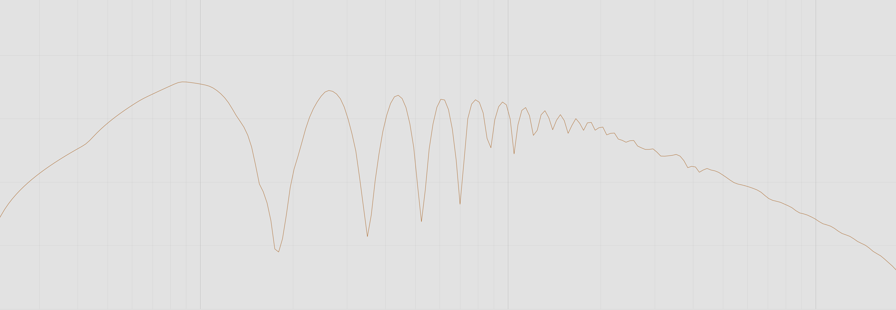
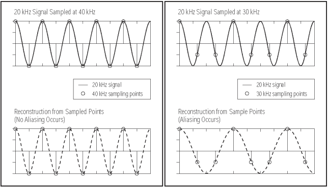

# Audio Analysis

## Frequency 

Frequency describes the number of waves that pass a fixed place in a given amount of time. Frequency is an essential concept in physics because it can describe any phenomena that exhibit periodic or rhythmic behavior. Frequency is also an important parameter used in engineering to specify the rate of oscillatory and vibratory phenomena, such as vibrations, audio signals, radio waves, and light. 

When talking about frequency in the context of audio signals, the frequency determines the pitch of the sound. The greater the frequency, the higher the pitch. Frequency is measured in Hertz (Hz), named after the German physicist Heinrich Hertz [^22]. One Hertz is equal to one cycle per second or a frequency of one cycle per second. The Hertz is the SI unit of frequency, which measures the number of occurrences of a repeating event per unit time. In the International System of Units (SI), the Hertz is defined as a multiple of the SI unit of frequency, the Hertz, and can be used to express other units of frequency; the kilohertz, megahertz, gigahertz, terahertz, and petahertz are commonly used multiples.
The frequency spectrum is a graph of the signal's amplitude versus frequency. The information in the frequency spectrum is not filled equally, i.e., higher frequencies are more densely packed than lower frequencies, so it is essential to specify the range of frequencies being considered. In a simple case where the signal is the output of a single sinusoidal oscillator, the signal consists of a single sinusoidal waveform. In this case, the signal's frequency spectrum consists of a single line at the signal's frequency. The frequency spectrum of a signal is often measured using a spectrogram.

A spectrogram is a two-dimensional representation of the signal's frequency spectrum. A spectrogram can be generated by filtering the signal using a bandpass filter and plotting the magnitude of the resulting signal over time. The frequency spectrum can be used to identify various components in the signal. For example, if the frequency spectrum has a single line at a specific frequency, then the signal is a sinusoidal function with that frequency. If the frequency spectrum has several lines at different frequencies, then there are multiple sinusoidal components in the signal, such as a series of harmonics. The frequency spectrum can also measure the amount of energy in each frequency component. The signal's power is the square of the signal's amplitude (or the square of the magnitude of the complex-valued signal).

[^22]: https://www.dhm.de/lemo/biografie/heinrich-hertz

\pagebreak

## Sampling

Sampling is the reduction of a continuous-time signal to a discrete-time signal. In the Audio world, this translates to converting a sound wave to a sequence of samples (a discrete-time signal). One sample represents a point in time that holds the value converted from the sound wave. The sample rate needs to be appropriately chosen to capture a sound wave digitally in a way that enough information is present to reconstruct that sound digitally fully. The sample rate defines the resolution used to represent a sound wave. Higher values will give a more accurate representation of the original sound wave but require more storage space and bandwidth. The sample rate of a sound wave is not the same as the frequency that represents the pitch of that sound wave. The sampling frequency (in Hz) is calculated as the sample rate divided by the length of the sample. The sample rate is the frequency of the digital representation of the sound wave, not the frequency of the sound wave itself. So the sampling frequency is much higher than the frequency of the sound wave. The Nyquist-Shannon Theorem [CITE] states that: 

> If a system uniformly samples an analog signal at a rate that exceeds the signal’s highest frequency by at least a factor of two, the original analog signal can be perfectly recovered from the discrete values produced by sampling.

The Nyquist Theorem states that to fully reconstruct a sound wave from a sampled version of that sound wave, the sample rate has to be at least twice the highest frequency in the sound wave. This is one reason why digital audio often sounds "thin" and "hollow" and is a common complaint about MP3s. The digital samples do not have to be taken at regular intervals. The resulting digital waveform is more faithful to the original waveform if the samples are taken irregularly and more frequently around the wave peaks.
Here is an example of a poorly chosen sample rate and its reconstruction [^23].

[^23]: Figure 13 Source: https://stackoverflow.com/questions/7972122/effects-for-bad-sampling-in-frequency-formula

\pagebreak

{ width=500px }

## Fast Fourier Transformation

The human ear automatically and involuntarily performs a calculation that takes the mathematicians years of education to accomplish. The ear transforms the waves of pressure that move through the air over time and converts them into a spectrum that describes the sound as a series of volumes at specific pitches. The brain turns this information into perceived sound.

A similar conversion can be done using mathematical methods on sound waves. The Fourier transform is a mathematical method to convert waveform data in the time domain into the frequency domain. The reverse Fourier transform turns the frequency domain back into a waveform. The Fast Fourier transform is built on the same principles. 

In 1965 the Fourier transform [CITE] used enormous amounts of computational power, which led James W. Cooley to invent the Fast Fourier transformation. The Fast Fourier Transformation [CITE] (FFT) has been used for the past decades to obtain the frequency domain representation of the waveforms. In this work, FFT's are used to convert the signal form from its original domain to a representation in the frequency domain. The FFT is performed on the windowed version of the signal. The features are extracted by applying a vector quantization on the frequency domain representation obtained. The results show that the features extracted using the Hamming function are very different from those extracted using the FFT without the Hamming function.

## Window function

A window function works by dividing the signal into several segments and using the same function on each segment. The result is that the frequency components of the signal are preserved, and only the magnitude is scaled. The window function determines the number of segments. The window function also determines the number of points that are used in the windowed FFT. This means that the windowed FFT is only good for a given size of the signal. A triangle window is a good choice for most signals. It is a good trade-off between not losing too much information and not wasting too many operations. A Hann window is used for signals with a large range of frequencies, such as audio signals. A Hamming window is used for signals that have large amounts of noise, such as images.

### fft_sinc

- This function is a good choice for signals with a large range of frequencies.
- This function is not good for signals with a lot of noise.
- This is a good choice for audio signals because it retains the low frequencies and it is fast.

### fft_hamming

- The fft_hamming function does a Hamming windowed FFT. This function is even faster than the fft_sinc function because it uses fewer points.
- This function is a good choice for signals with a lot of noise. This is not a good choice for audio signals because it removes the low frequencies.

### fft_blackman

- The fft_blackman function does a Blackman windowed FFT. This function is ideal for audio signals because it does not remove the low frequencies.
- This function is not good for signals with a lot of noise. This is not a good choice for signals with a very large range of frequencies.

### fft_kaiser

- The fft_kaiser function does a Kaiser windowed FFT. This function is good for signals with a large range of frequencies, and that also have a lot of noise. This function is not good for audio signals.
- This function is not good for signals with a large amount of noise.

\pagebreak

## Audio Features

### Brightness

Brightness either alludes to a solitary note or harmony played at a specific time or to a track as an entirety. In a note or harmony setting, the brightness would be a discrete occasion, whereas the brightness of a track would be a worldwide element. A note's pitch usually characterizes brightness, e.g., a C' (played in the top octave) is thought of as less bright than a C" (played in the subsequent octave). A musically talking with a similar note (same key), it has an alternate brightness. Similar applies to harmonies. Brilliance is also associated with harmonicity - powerful harmonies are generally thought to be "cheerful," which overall likewise prompts a sensation of expanded brilliance.

In contrast, minor harmonies are depicted as "sad" or "melancholic," providing the audience with the sensation of diminished brilliance [CITE]. Talking, "brightness portrays the unearthly dispersion of frequencies and portrays whether a sign is overwhelmed by low or high frequencies, individually. A sound becomes more splendid as the high-recurrence content turns out to be more predominant, and the low-recurrence content turns out to be less predominant." As far as MIDI [^24], the brightness is straightforwardly associated with the pitch of a note, which is worth somewhere in the range of 0 and 127.

[^24]: https://midi.org/

### Loudness

Loudness essentially depicts how clearly a note has been played. Loudness makes characteristical spikes in waveforms (sound) or influences the volume quality of MIDI notes. Over the previous years, music makers have combat in an alleged loudness war, attempting to make tracks with an enormous and serious sound. This leads to more thick and smaller waveforms, making it harder to dissect sound records effectively. As far as representation, individual loudness can influence the power of tones or visual occasions.

### Tonality

The resonance or key portrays which notes are utilized inside a song. Even though resonances hold a substantial arrangement of notes, most notes are essential for a few resonances. Also, due to compositional opportunity, the resonance can change whenever inside the track. It is not said that assuming a melody is written in a specific key and holds back notes from that scale. This is pretty normal, particularly in Jazz and Latin music, making it much harder to distinguish the proper resonance while dissecting a melody. Like brilliance and harmonicity, resonances have a specific inclination joined, either happy or melancholic. This makes resonance identification an intriguing assignment while attempting to picture bits of music.

### Tempo / Beats per Minute

The beat of a track is a decent base for changing the overall style of any melodic representation. Quicker melodies transport a sensation of energy or aggressivity, whereas more slow tracks typically actuate a laid-back and repressed feeling. BPM represents beats per minute, a mathematical worth that portrays the number of quarter notes each moment played during a track. The rhythm or beat of a track is undoubtedly what gives the track the force and flair that is unique to the track. Rhythm and pace are the most vital components for the representation of a track. The rhythm and pace of a track are stand out amongst essential components of music and melody.

The formula to calculate the BPM is:
$$
( 60 / MS ) * 1000
$$

## Extracting Audio Features

Digital analysis of audio signals emerged with the advent of the digital age. Julius O. Smith III [^25] can be considered one of the pioneers who did significant work in physical signal analysis and processing. He lays the foundation for this field of research in his Book "Physical Audio Signal Processing" [CITE]

A range of audio features can be extracted from a given audio signal through either parametric or non-parametric methods. A frequency table is constructed from the audio signal in parametric methods, and the audio features are extracted from the table. In non-parametric methods, the audio signal is transformed to make the feature extractable. For example, in the frequency domain, the low-frequency components are extracted.

The audio signal can be segmented into frames, usually of size 20ms. The segmented signal can be transformed into different domains to extract the audio features. The domains used are:

**Frequency domain:** This domain is used to extract the frequency and its harmonics. Usually, the signal is first transformed into the frequency domain using a Fourier Transform. This is an efficient method, and it is fast. However, it requires a large amount of memory, and the computation of the frequency spectrum is not trivial.

**Spectral-domain:** This domain extracts the spectral amplitude at each frequency. It is a subset of the frequency domain.

**Energy**: It is the total energy of the signal. It is computed as the sum of the square of the amplitudes of the frequency components.

**Onset Detection**: Onset refers to a sudden spike in amplitude that can be measured.

[^25]: https://ccrma.stanford.edu/~jos/
