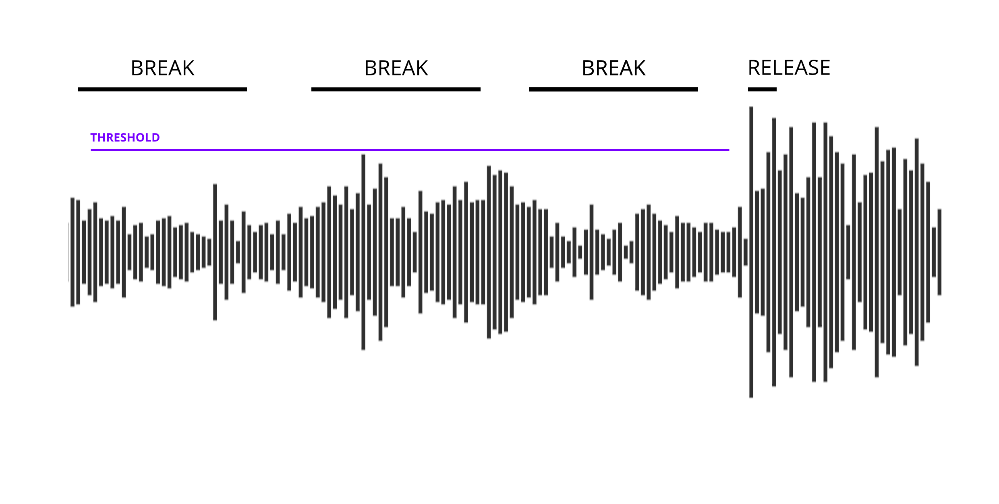

# Design and implementation

## Components
This application consists of 3 Parts. The Audio Analysis, the event system and the rendering. These parts build a chain where firstly the Audio Signal is analyzed, then translated into events and finally based on these Events the artworks are rendered.

The Artwork consists of 5 Layers, each Layer does feature a generator to individually react on the Events send by the event system.

### Native Application

The main use case of a native application will be to provide performance optimizations and easy access to the GPU and the periphirals. The application can be executed on every x86 platform while providing similar features. Using Unity3D allows for GPU optimizations, this way we can render the artworks on the GPU while keeping the analysis and data translation to the CPU. This approach will diversify the workload and allows for higher performances.

Unity3D does feature its own build process which allows to compile the application for a wide variety of platforms. This application is targeting the desktop operating systems mainly GNU/ Linux, Windows and MacOS and a native version can be compiled for each system. To build a native application for a desktop Unity first compiles the C# code to an intermediate language. This language is used alongside the meta data to make up the byte code. The mono runtime is able to execute that bytecode and interpret it on each platform accordingly.

{ width=500px }

\pagebreak

### Audio Analysis

A list of all Input devices can be obtained using Unity3D. Usually the Operation System does flag one input as the primary one. The application will start to listen to input data using the primary input. The data is analysed with the fast fourier transform alogrithm using the blackman window function.

The information inside a Audio Spectrum is not equally split up. Instead of following a equal distribution it followes a unequal distribution. This means that there is much more information between 20 - 60hz than there is between 10000 - 10040hz. To analyse the audio it is needed to have certain channels with specific frequency data. The lowest channels would feature the bass while the higer channels feature the treble. Since the audio signal does have 20000hz individual values it is best to dumb down the values, usually into 8 channels.

For further analysis the Input data will be devided into 8 Channels. Based on this pattern:

20 - 60hz
60 - 250hz
500-2000hz
2000-4000hz
4000-6000hz
6000-20000hz

Adding to this there is also a average of all channel computed which will be holding the amplitude. Since we are listening to non normalized input data there is no way to know how high the values are going to be. Dealing with a quite Signal will result in really low values while loud signals do result in high values. To deal with that uncertanity a normalization process is used. To normalize the values the frequency value of each channel is divided by the highest recorded frequency for that specific channel. This will result in normalized values between 0 and 1. To adapt to certain loudness changes the higest frequency will be constantly decreased by a factor of 0.005. This is used to always re evaluate the highest frequency and to quickly adapt to loudness changes.

To smooth out the values for each channel there is a smoothing process when the values are decreased. Instead of  apruptly jumping to a low value it is decreased gradually. This effect can be seen when visualizing each channel. The animation is less jumpy and more smoothed out.

{ width=500px }

\pagebreak

### Audio Feature extraction

There are 2 kinds of audio features which can be extracted. Computed features give a rough understanding of the Audio signal, these include energy levels, Frequency domain and spectral spread. These features are computed directly from the frequency of the audio signal and work with only one snapshot of the frequency. Furthermore these values are not normalized by default which make them a not reliable option to analyze realtime audio which is prone to change in tonality, amplitude and energy. 

#### Onset detection

The second kind of audio features is deteremined by algorithms and cannot be determined by applying to a frequency snapshot. These algortihms take past input into account and feed them into the next iteration. Each channel is buffered and saved temporarily to be able to compare to the incoming audio. This enables one of the most used features in this project called onset detection. The onset detection algorithm works by comparing the buffer to the current audio signal and evaluates if a sudden change in aplitude occurs. This algorithm can be fine tuned to detect big spikes in audio that likely appear after long breaks or to listen to subtle changes for example the beating of a drum. 

{ width=250px }

\pagebreak

#### Break detection

One of the features implemented was the break detection algorithm. The break detection can differentiate between long and short breaks. These detection algortihms are specifically tailored at the choosed genre of music that is used since they use a reference to compare the current running audio signal against. A break is indicated by a low low-end and little energy in the treble. To detect a break the detection algorithm looks at the first channel of the deconstructed audio to compare the average of the buffered values against the reference values. To classify for a long break the average of the first channel is not allowed to reach the threshold within a given timeframe. To save processing power the algorithm looks at the audio signal 3 times each one second apart. Each iteration of the break detection algorithm the previous state of the run is saved. When the average of the first channel is not able to cross the threshold on 3 consecutive runs of the detection algorithm, a long break ready event will be triggered. This long break ready event indicates that the song currently is in a long break phase. With the next low-end onset this phase will end and the saved values that are used for the long break detection algorithm are cleared again. 

The values of the first channel are compared against reference values which are defined in the application. These reference values do contain averages of the first channel of various reference songs. The reference songs have choosen to feature a range of different audio characteristics. Based on tonality, spectral spread and intensity these songs have been analysed and converted into a machine readable format. The average of the first channel of each reference track is computed and concatinated into a list to serve as a threshold reference for the realtime audio. 

{ width=500px }

\pagebreak

To detect a short break the same mechanism is used, the only difference is that instead of using 3 saved values to detect a break only 1 is used. A onset of the bass after one successfull iteration of the break algorithm indicates a short break. Afterwards the saved values will also be cleared. 

{ width=500px }

### Feature conversion

To make use of the analyzed features they need to be converted into a machine readable form. Unity3D offer an event system that lets the application send events and make them globally accessible. These events can contain pieces of data or extra information. Usually a event consists of a name and additionally some data. Using an event system provides an easy way to communicate data in between the components and allows for loose coupling. The event system acts as a middleware between the audio analysis and the graphical user interface by providing an easy api. In contrast to modern web development the event system dispatches events globally and the client subscribes to them instead of calling the event system for updates.

Having an event system does also allow for easy extensibility in form of plugins. The analysed audio could also be translated into midi data, text input or raw pixels. More on this in the [Outlook](## Outlook) section. 

{ width=250px }

\pagebreak

### Scene setup

The scene is made up out of 5 Layers, a processing unit, a camera and lights.

The Camera is wrapped with another component which can be controlled individually. 
The processing unit does provide the AudioPeer which acts as the AudioAnalyser and the EventSystem which converts the audio featuers into events and sends them accordingly.
Each inidividual layer does contain a Script which dynamically loads a Model or Visual Effect. These Scripts are listening for Events and modify there parameters accordingly.
Finally there are some global lights to illuminate the scene.

{ width=250px }

### Model generation

### Generative Camera movements

### Transitions

## Input Data

{ width=500px }

## Conclusion

## Lessons Learned

### Unity3D

### Performance of realtime systems
