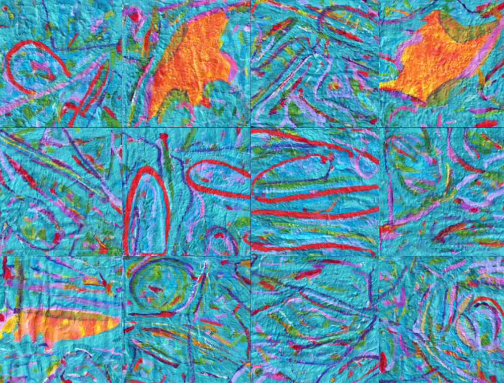
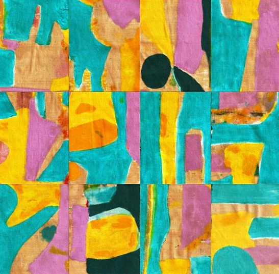
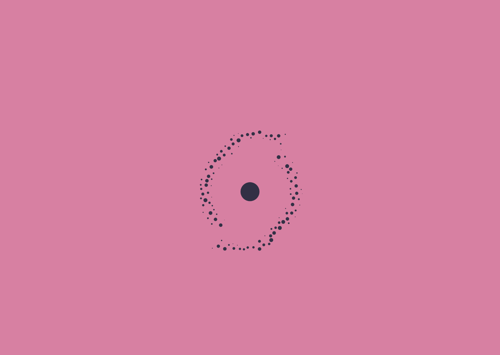
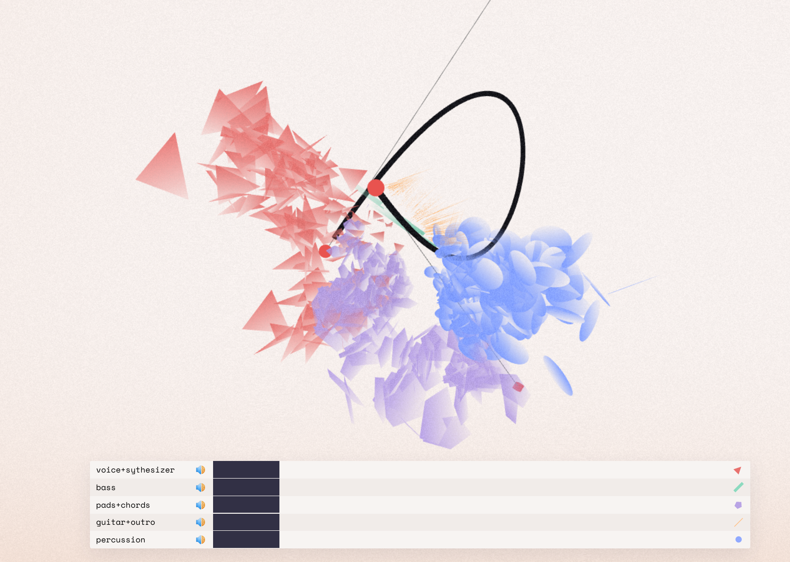

# Related Work

In the following, two related artworks will be discussed. Both works use a genetic algorithm in order to create artworks. In 3.1, a playground is given. The computer explores the creation of new artworks by tiling this playground and by re-ordering the tiles. This gives an unpredictable outcome but does feature a visual style. The rules of the playground define this initial visual style. The second work explores how music as data can paint and visualize artworks. Each work in their gallery implements this data differently to create new and unique artworks. One of the central questions is "How does music actually look like" is explored by interpreting music in different ways. Furthermore, this project explains how music is made and what it is made of on a fundamental level. Like this thesis, this project views music as data that can be visualized differently.

## Generative & Conceptual Audio-Visual Art

In their Paper "An Evolving Musical Painting on the Boundary Between Permanence and Change" [CITE] by Yiannis Papadopoulos*, David Parker, Martin Walker, Emma-Jane Alexander, an ever-changing painting was drawn. They describe the project as "The research vision of this project is to create a new strand of research that intersects computer science, philosophy, medicine, and art with potentially novel applications and impact on conceptual art, art therapy, and educational games." [CITE]

{width=300px}

Additionally, music by the musicians Roberto Bono, Andrea Alberti, and Bob Salmieri have been used to create a matching landscape by applying the same logic to their music. The painting, just like the music, is created by defining a "playground," a set of rules and systems that has been put into place by the artists. Once the playground is set up, the computer explores new sounds and images by tiling the playground into multiple tiles and rearranging them, creating new paintings. Similarly, the music is chopped and tilled and does make up the soundscape for this artwork. Furthermore, this project explores the potentials of therapeutic effects of these artworks. Informal feedback by patients and clinicians that have experienced this art suggests that this may have a therapeutic effect on people with long-term conditions like autism, tinnitus, or dementia. 

Similar to this thesis, the project explores the idea of a mix between generative art and human intervention. New artworks are created by defining a playground that the generative algorithm can manipulate. By shaping the playground differently, the resulting artwork will differ. The process is defined in how a user can participate in creating new artwork by making a decision.

{width=400px}

\pagebreak

## vi.sion mixing senses

In the audiovisual art project "vi.sion mixing senses" von Benjamin Double, Leon Fuchs, and Guido Schmidt, the question "Wie sieht eigentlich Musik aus?" [CITE] is explored. In their Gallery, the Project features three generative Artwork to answer this question. The first Artwork, "dot" [^26], lets the user choose to input audio via the system default microphone, an uploaded media file, or a predefined musical piece. Based on this music, the Project's logo is generated, as shown in Figure 12. The next artwork [^27] plays back five samples and lets the user choose whether it represents a color, emotion, or shape for each sample. Based on the user input, the Artwork contains all the user-selected properties. Furthermore, all samples are played simultaneously to create a new track. The Artwork becomes interactive when the music is played back. It is also possible to be rotated in a 3D room while it changes shape and color based on the music.

{width=400px}

\pagebreak

The final and last Artwork named "patterns" [^28] is an interactive audiovisual experience that runs on the web just like the other pieces. The user can define a curve in a 3D room. This curve can be saved and used to create the Artwork. As shown in Figure 13, this curve is used to spawn random shapes with random colors around. These shapes and colors are generated when the music progresses. The music is split into 5 Stems. Each stem can be played back separately; by muting one, the artwork evolves differently since the input data is no longer the same. 

{width=500px}

\pagebreak

[^27]:https://audiovisio.mixing-senses.art/totem
[^28]:https://patterns.mixing-senses.art/
[^26]:https://dot.mixing-senses.art/

