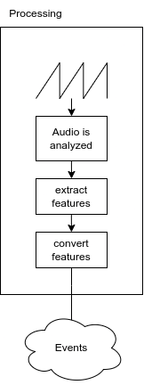

# Requirements

In the following, the requirements analysis will be presented. Since this application can be split into two main parts, the audio analysis, and the rendering, each part comes with its requirements, which do not apply vice versa. In 5.1, the functional requirements are laid out and discussed. These requirements feature that the application **must** fulfill to be called successful. In 5.2, the non-functional requirements are described. The requirements are not needed to prove the application's functionality but to enhance the system. As stated, this application will create artworks based on events that are extracted from an incoming audio signal. 

## Functional Requirements

### Audio

#### Input

The application must be able to recieve input Data in form of an audio signal. The application must be able to select the default audio device.

#### Analysis

The application must be able to analyse the incoming audio and convert it to a machine readable format. The application must create a audio buffer. The sample size of the buffer can be specified.

#### Conversion

The application must be able to extract following features:

* onset detection
* short break detection
* long break detection
* loudness

The application must feature an event system that dispatches event when the feature is extracted.

### Rendering

#### Render artwork

This applicaiton must be able to render a artwork consisting of 5 Layers. Each layer can hold various GameObjects.

#### Compute new Artworks

This application must be able to compute new artworks without an audio input signal. When an input audio signal is received the scene becomes responsive and starts to regenerate artworks.

#### Effects

This application must feature effects like a camera shake and transitions.

## Non-functional Requirements

### Accessibility

In order to provide this application to a bigger audience, this system should be accessible. As a consequence, this application should be accessible from as many operating systems as possible.

### Variance

The system shall create generations of artworks that are well distinguishable from each other. Therefore it is helpful to create an unpredictable approach. On the other hand, it is important that the approach is not completely random because the system shall be able to generate visually pleasing artwork. To generate a visually pleasing artwork, there needs to be some supervision involved. By using many different models and Generators, it is possible to create artworks with a higher variance.

### Extensibility

It should be easy for another artist to add a function to the primitive set; for example, a new type of Generator could be added, or a new lighting system might be implemented. This is desirable because this allows fast testing of new ideas.

### Loose coupling

There are some steps that are necessary for any 3D application. Mainly the rendering pipeline and setting up the scene graph. Therefore the components shall be coupled loosely so that parts of this application can be reused in other projects. The audio analysis could be extracted and fitted to a new rendering pipeline thus making each part truly reusable.

\pagebreak

