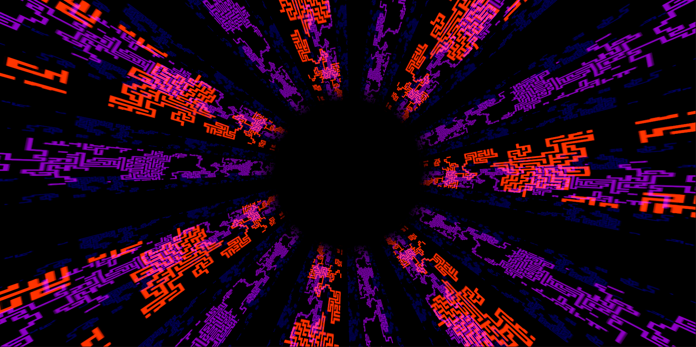

# Design and implementation

## Tech Stack

### Unity3D

*Unity* [^29] is a cross-platform game engine developed by Unity Technologies and developed video games for PC, consoles, mobile devices, and websites. Games can be developed using C#, JavaScript, and the Unity Scripting API. Unity has been used to develop games in various genres, including RPGs, platformers, fighting games, and MOBAs. Unity Technologies likens the design of the Unity engine to that of standard movie production software – the director, cinematographer, actors, lighting technician can work independently of each other but still create a unified product, in this case, a video game. Unity was initially developed by David Helgason, creator of the game "The Crystal Hammer," as a game engine for his company, Over the Edge, in 2004. Helgason was joined by two other co-founders, Nicholas Francis and Joachim Ante; as they were working on another project, "ToyWars," they found they needed a game engine. Unity 1.0 was released in 2005. Unity Technologies' original slogan was "Developed by gamers, for gamers ."The company changed the slogan to "Develop once, deploy everywhere" in 2013. 

While Unity is used chiefly for Game Development, it shows great potential for Animation Films and Art projects due to its flexible nature. In this paper, Unity was chosen because it features excellent potential to build a performant cross-platform application with access to the System I/O devices. The framework makes creating easy since the Model can be visually previewed and altered inside the Unity editor while the application logic can be written in C#.

[^29]: https://unity.com/

### C Sharp

C# [^30] is a programming language that runs on the .NET Framework. It is a multi-paradigm programming language that supports structured, imperative, functional, generic, object-oriented, and component-oriented programming styles. C# is an object-oriented language supporting encapsulation, inheritance, polymorphism, multi-threading, operator overloading, and exception handling. Unlike C++, the C# language does not support multiple inheritances. The C# language is syntactically similar to C++ and Java. Unlike Java, C# has explicit support for the Object-Oriented Paradigm. However, C# is statically typed and does not require the explicit declaration of variables. The .NET Framework provides a managed execution environment called the Common Language Runtime (CLR), which executes common language runtime bytecode that has been compiled from C# source code. The CLR provides memory management, type safety, exception handling, garbage collection, security, and thread management.
In this thesis, C# was used to implement the logic for the generators, the audio processor, and the camera scripts.

[^30]: https://docs.microsoft.com/en-us/dotnet/csharp/

### P5.js

P5.js [^31] is a javascript framework and the successor to the famous processing framework @bohnacker_generative_2012. Casey Reas and Ben Fry developed it. The framework is based on the same concept as Processing, an open-source language built on Java. The framework provides a Javascript API for writing code for the web browser. The code is written in the Processing language, based on a java-like syntax. P5.js allows us to draw different primitives, create images, videos and audio, text, shapes, and 3D models. The framework also provides a library for the browser and mobile devices. This library contains the core processing functions like the mouse, keyboard, color, and built-in functions. P5.js is often used to create generative artworks since the framework offers superb flexibility while being easy to use. The framework is based on the p5 core. The core is available for all platforms since it is written in plain Javascript. It is a simple library with less than 8000 lines of code. P5 core is written to enable it to be easily integrated into other projects.
The core is powered by another library called p5.dom. The dom can be used to manipulate the webpage. By using this library, elements on a webpage can be manipulated. We can create elements like objects, images, and shapes or change the web page. The framework also uses the p5.sound library. This library contains functions for playing music and sound effects. The library is based on the html5 audio API. The library contains predefined functions for playing sounds and music. Using the web audio API makes it possible to get input from the system's default microphone. P5 does feature to apply a Fast Fourier Transformation to convert the time-based input audio to the frequency domain.

[^31]: https://p5js.org/

### Gimp

GIMP or the Gnu Image Manipulation Program [^32] is a freely distributed software for such tasks as photo retouching, image composition, and image authoring. It works on many operating systems in many languages. It is freely available to anyone and is distributed under the GNU General Public License. It can be used as a simple paint program, an expert quality photo retouching program, an online batch processing system, a mass production image renderer, an image format converter, and much more. It is expandable and extensible. It is designed to be augmented with plug-ins and extensions to do just about anything. The advanced scripting interface allows everything from the most straightforward task to the most complex image manipulation procedures to be easily scripted. Gimp can also be used to generate Textures and patterns. This feature alone makes GIMP an essential tool for any Artist. In this Thesis, GIMP is mainly used to create textures and fine-tune generated Images to suit the overall visual experience better.

[^32]: https://www.gimp.org/ 

\pagebreak

## Input Data

In order to regenerate artworks, this application does require an Audio Signal. While every audio signal can be used, the system was trained on musical pieces. In contrast to speech, music does feature a broad frequency spectrum that contains more information than recorded speech. Furthermore, to prove the concept, this application is specifically trained on the *Trance* Music Genre, consisting of a full low end and crisp highs. This genre has been chosen because it features a deterministic song structure. Moreover, this genre's Tracks can be easily mixed, creating a seemingly endless musical piece. The following figure shows a typical song structure for a modern trance track.


The song structure does indicate brakes and breakdowns. This genre usually features a quiet intro followed by a clean kick and bass combination. This setup builds up until the drop is reached after a short break. These short brakes are usually 4 to 8 bars long and are resolved by a sudden spike in the low end.
Using digital audio allows for a near-lossless signal to pass through to the application and only contains non-audible noise. Theoretically, it is possible to use any input data, whether white noise, alternative rock from the 80's or amplified transistor noises captured by the digital-analog converter. However, bass-heavy music with a clear track structure provides enough information for the system to function correctly. 
This system has been tested with normalized audio, which results in minimal change in loudness. The musical pieces have been shuffled to provide a maximal range of variance while staying true to the genre. These musical mixes calibrate the input to prevent overfitting since they contain different energy levels, track arrangements, and harmonics.

{ width=500px }

\pagebreak

## Project Setup

### Hardware

There are several ways to input audio into the application. Audio interfaces made for music production and recording feature an excellent input audio quality. Microphones are a great way to record voices and go on zoom calls. However, the standard built-in microphone is optimized to record speech, not high-quality music.

In this paper, the Denon x1600 Mixer [^33] filters the audio signal before it reaches the audio interface. Using the hardware knobs, this mixer can filter out the mid, highs, and lows. Additionally, the mixer applies a -3db headroom [^34] to the audio signal to reduce the distortion effects. Finally, this audio signal is routed through 2 RCA cables to the Audio DJ 4 [^35] interface. This interface can pick up an analog signal and transform it into a digital one. A so-called Digital Analog Converter (DAC) works by converting a digital signal into an analog one. This interface can pick up a more comprehensive range of analog signals. This interface is superior to the simple ADC since it can make a wide range of analog signals digital. Within this interface, there are mainly two kinds of interfaces. The first one is the ADC. The ADC is an interface that can pick up an analog signal and turn it into a digital one. The second one is the DAC. It is an interface that can pick up digital signals and turn them into analog ones. In this thesis, the ADC converts an analog signal to a digital one. This setup allows for triggering certain events in the application which are based on a particular frequency spectrum.

[^34]: https://en.wikipedia.org/wiki/Headroom_(audio_signal_processing)
[^33]: https://www.amazona.de/test-denon-dn-x1600/
[^35]: https://www.minimag.tv/page/16485/11017/native-instruments-audio-4-dj.html

{width=350px}

\pagebreak

### Native Application

The primary use case of a native application will be to provide performance optimizations and easy access to the GPU and the peripherals. The application can be executed on every x86 platform while providing similar features. Using Unity3D allows for GPU optimizations. This way, the artwork can be rendered on the GPU while keeping the analysis and data translation to the CPU. This approach will spread the workload between computational systems and allow higher performances.

Unity3D does feature its build process, which allows compiling the application for a wide variety of platforms. This application targets GNU/ Linux, but could be theoretically build for every system. To build a native application for a desktop, Unity first compiles the C# code to an intermediate language. This language is used alongside the metadata to make up the byte code. The mono runtime can execute that bytecode and interpret it on each platform accordingly.

{ width=500px }

### Architecture

This system is split into the Processing and the Generative Part. The processing mainly consists of an AudioPeer class responsible for analyzing the audio and saving the current incoming stream to a list. The Feature Extraction / Event System picks up that list and extracts audio features. See 5.4.3. When the features are successfully detected, this class does send out an Event. These classes are added to the Scene by attaching them to empty GameObjects.

The Generative Part consists of 5 Layers, a camera, and some Utils. Each layer does contain a Generator that can instantiate a part of the artwork, see 5.4.5. The utils help create Transitions while the camera provides a viewport for the Scene. The following chapters go into more detail about each Part.

\pagebreak	

{width=400px}

\pagebreak

## Components

This application consists of 2 Parts, the Audio Analysis, and the rendering. These parts build a chain where firstly the Audio Signal is analyzed, then translated into events, and finally, based on these Events, the artworks are rendered.

### Audio Analysis

A list of all Input devices can be obtained using Unity3D. Usually, the Operation System does flag one input as the primary one. The application will start to listen to input data using the primary input. The data is analyzed with the fast Fourier transform algorithm using the Blackman window function.

The information inside an Audio Spectrum is not equally split up. Instead of following an equal distribution, it follows an unequal distribution. This means that there is much more information between 20 - 60hz than between 10000 - 10040hz. The lowest channels would feature the bass, while the higher channels feature the treble. Since the audio signal does have 20000hz individual values, it is best to dumb down the values, usually into six channels.
For further analysis the Input data will be devided into 6 Channels. Based on this pattern:

20 - 60hz (channel 1) 60 - 250hz (channel 2) 500-2000hz (channel 3) 2000-4000hz (channel 4) 4000-6000hz (channel 5) 6000-20000hz (channel 6)

Adding to this, there is also an average of all channels computed that will be holding the amplitude. Since we are listening to non-normalized input data, there is no way to know how high the values will be. Dealing with a quiet Signal will result in low values, while loud signals result in high values. To deal with that uncertainty, a normalization [^36] process is used. To normalize the values, the frequency value of each channel is divided by the highest recorded frequency for that specific channel. This will result in normalized values between 0 and 1. To adapt to specific loudness changes, the highest frequency will be constantly decreased by a factor of 0.005. This is always used to re-evaluate the highest frequency and quickly adapt to loudness changes.

To smooth out the values for each channel, there is a smoothing process when the values are decreased. Instead of abruptly jumping to a low value, it is decreased gradually. This effect can be seen when visualizing each channel. The animation is less jumpy and more smoothed out.

[^36]: https://en.wikipedia.org/wiki/Audio_normalization

{ width=500px }

\pagebreak

### Audio Feature extraction

Computed features give a rough understanding of the Audio signal. Two kinds of audio features can be extracted. These include energy levels, Frequency domain, and spectral spread. These features are computed directly from the audio signal's frequency and work with only one snapshot of the frequency. Furthermore, these values are not normalized by default, making them unreliable to analyze real-time audio, which is prone to change in tonality, amplitude, and energy. 


#### Onset detection

The onset detection feature is extracted using an algorithm on a series of frequencies and cannot apply to a single frequency snapshot. Each incoming frequency snapshot needs to be buffered to create a series of frequencies. This buffer does contain the last 512 frequencies snapshots of each channel. 

This enables one of the most used features in this project called onset detection. The onset detection algorithm works by comparing the buffer to the current audio signal and evaluates if a sudden change in amplitude occurs. This algorithm can be fine-tuned to detect big spikes in audio that likely appear after long breaks or to listen to subtle changes, for example, the beating of a drum. 


{ width=250px }

\pagebreak

#### Break detection

One of the features implemented was the break detection algorithm. The break detection can differentiate between long and short breaks. These detection algorithms are specifically tailored to the chosen genre of music used since they use a reference to compare the current running audio signal against. A break is indicated by a low low-end and little energy in the treble. To detect a break, the detection algorithm looks at the first channel of the deconstructed audio to compare the average of the buffered values against the reference values. To classify for a long break, the average of the first channel is not allowed to reach the threshold within a given timeframe. The algorithm looks at the audio signal three times to save processing power, each one second apart. Each iteration of the break detection algorithm, the previous state of the run is saved and used as input again. When the average of the first channel is not able to cross the threshold on three consecutive runs of the detection algorithm, a long break-ready event will be triggered. This long break-ready event indicates that the song is currently in a long break phase. With the subsequent low-end onset, this phase will end, and the saved values used for the long break detection algorithm are cleared again.

The values of the first channel are compared against reference values which are defined in the application. These reference values contain averages of the first channel of various reference songs. The reference songs have been chosen to feature a range of different audio characteristics. These songs have been analyzed and converted into a machine-readable format based on tonality, spectral spread, and intensity. The average of the first channel of each reference track is computed and concatenated into a list to serve as a threshold reference for the real-time audio.

{ width=500px }

\pagebreak

To detect a short break, the same mechanism is used. The only difference is that only one is used instead of using three saved values to detect a break. The onset of the bass after one successful iteration of the breaking algorithm indicates a short break. Afterward, the saved values will also be cleared. 


{ width=500px }


### Feature conversion

To use the analyzed features, they need to be converted into a machine-readable form. Unity3D offers an event system [^37] that lets the application send events and make them globally accessible. These events can contain pieces of data or extra information. Usually, an event consists of a name and adds some data. Using an event system provides an easy way to communicate data between the components and allows for loose coupling. The event system acts as a middleware between the audio analysis and the graphical user interface by providing an accessible API. In contrast to modern web development, the event system dispatches events globally, and the client subscribes to them instead of calling the event system for updates.

Having an event system also allows for easy extensibility in the form of plugins. The analyzed audio could also be translated into midi data, text input, or raw pixels.

[^37]: https://docs.unity3d.com/Packages/com.unity.ugui@1.0/manual/EventSystem.html


\pagebreak

### Scene setup

The scene comprises 5 Layers, a processing unit, a camera, and lights.

The Camera is wrapped with another component that can be controlled individually. The processing unit does provide the AudioPeer, which acts as the AudioAnalyser, and the EventSystem, which converts the audio features into events and sends them accordingly. Each layer does contain a Script that dynamically loads a Model or Visual Effect. These Scripts listen for Events and modify their parameters accordingly. Finally, there are some global lights to illuminate the scene.

{ width=250px }

### Generators

Each layer does feature its Generator Script. This setup makes sure that each layer is rendered in the correct position and does feature the right assets and models. In general, there are 5 Layers, each assigned to its Generators. The Generator Script in itself is simple and generic. It exposes a list that can be filled in the Unity Editor UI with GameObjects. When initialized, one random GameObject from that list is chosen and displayed. While it is technically possible to assign every GameObject to a particular Generator, it is advised to reserve the upper Layers for smaller Objects which can be easily layered above the rest. The Layers are stacked across the Z-axis to minimize clipping.

Here is the code for the Generator Script:

```c#
void AddRandomGameObject()
{
	var r = Random.Range(0, GameObjects.Length);
    var tp = transform.position;
    var position = new Vector3(tp.x,tp.y, tp.z)
	GameObject gb = GameObjects[r];
	var randomObj = GameObject.Instantiate(gb, position, Quaternion.identity);
	randomObj.transform.parent = gameObject.transform;
}
```

\pagebreak 

### Tunnel

The so-called tunnel is one of the main elements in the scene. It builds the base of the scene by providing an ever-changing background. In itself, it layers 4 Textures and moves them forward or backward following a cylindrical shape. It features properties like movement speed, rotation, and twist per layer. One of the most used features is the dynamic texture assignment via an API. While it is possible to control each layer on its own, global control does unify most of them. Similar to the properties on each layer, there is a global speed and rotation next to a global brightness.

On the application start, it slowly gets brighter. This is because it hides the adjusting phase of the audio analysis. When starting, the maximum frequency could not be determined yet. Thus the normalized values do not take the whole spectrum into account. This usually shows itself in really shaky values, which tend to jump between high and low.


{ width=500px }

\pagebreak

### Fractals

The mandalas are used as a secondary visual. These are meant to be layered on top of Layer 1 and act as a backdrop for the rest of the scene. These mandalas are generated with p5.js and included in the final project.

This is the code to generate the mandalas.

```javascript
const makeMandala = (position) => {
  const layers = layerConstructors.map((lcon) => {
    let picker = random(1);
    const draw = picker > lcon.weight;
    return lcon.init({
      position,
      draw,
    });
  });
  return layers;
};
```

This makeMandala function does generate a random number between 0 and 1. This value is then compared against a weight. This weight defines the likely hood that a specific layer is chosen. This is controlled randomness. 

Each layer constructor does contain a name, init, and weight field. The name does make the debugging process easier by providing a human-readable identifier for the drawn shape. The init function does contain the actual computation of the layers. This can be drawing a hexagon, a line, or a group of squares. As explained above, the weight indicates the likely hood that this particular shape is chosen.
Here is the basic shape code that draws a hexagon, a circle, or square background.

```javascript
const layerConstructors = [
  {
    name: "Shape",
    init: (props) =>
      outlineShape({
        ...props,
        ...setState(state),
      }),
    weight: 0.3,
  },
];
```


This relatively simple code can generate an endless amount of fractals with a given style. This style is defined by the weight of each layer, the init function, and the color palette. This generative system is used to generate the assets for another generative system. In order to save on performance, these visuals are rendered beforehand and are saved as a .png. Displaying an image comes with a much lower performance overhead than creating the image in real-time.

Each of these layers is rendered with a transparent background and does contain only black and white colors. This allows us to easily re-color the fractals in the final application to match the general theme. 

{ width=350px }

\pagebreak


{ width=350px }

{ width=350px }

### Lighting

One exception to generating the layer contents is the lighting systems. It is required to have at least one Light Source in the scene to illuminate the models. These Lights are pre-back to the scene and thus live in their GameObject. A Point Light [^38] is used for the illumination since it provides a Radius, Intensity, and a parameter to control the color. Having one global light simplifies the scene setup since it is possible to fine-tune it more easily. Also, when transitioning between different Artworks, this light can be used as a transition effect to darken the whole scene to allow for a smooth transition.

The color of the light is used to give the scene a particular look. Every model containing a lot of white textures or colors will get tinted by the light color. This could be used to match the background or paint every model in a complementary color compared to the background.

[^38]: https://docs.unity3d.com/Manual/Lighting.html

### Particle System

In the base example, there are 2 Particle Systems used. These Systems can easily co-exist on the same layer since they add a small visual footprint. The built-in Unity Particle engine [^39] is mighty and allows for visual particle effects. Each particle contains a 2D Texture that can be randomly allocated. Also, speed, direction, and gravity can be adjusted. This allows for fine-tuning the behavior of the System without adding much complexity. For the sake of simplicity, the Particle System will not be created in a generative manner but will be provided as a Unity Prefab [^40] instead. 

Unity build-in particle System is performant out of the box already, so there are not many optimizations that can be done. One factor that has the most impact on the System's performance is the Particle Count or the Spawn rate. The Spawn rate indicates how many particles are spanned in a second. After its initial spawn process, these particles follow their path, which the parent system generates. Another optimization is only to generate particles visible in the viewport. 

[^39]: https://docs.unity3d.com/ScriptReference/ParticleSystem.html
[^40]: https://docs.unity3d.com/Manual/Prefabs.html 

{ width=400px }

\pagebreak

### Generative Camera movements

One common technique to generate realistic Camera movements is to use the Perlin noise [^41] to generate a random value for the x, y, and z-axis intensity over time. For each axis, one Perlin noise is used that generates smooth values, which are then normalized and finally applied to the corresponding axis. To control the intensity, each axis does expose an intensity property that multiplies the normalized value to strengthen or weaken the effect of the Perlin noise.

A camera shake is a widely used effect to emphasize certain events. Mainly used in the Gaming and Video industry, this effect can also be adapted to our project. Paired with the onset detection after a long break, this emphasizes the Artwork and gives a dynamic approach. When a Camera Shake Event is emitted, the Camera Processor picks it up. To shake the camera, the intensity of the camera movement script is quickly increased on decreased. This leads to a camera shake effect.

[^41]: https://docs.unrealengine.com/4.27/en-US/AnimatingObjects/Sequencer/Cameras/CameraShakes/

{ width=400px }

\pagebreak

### Transitions

To regenerate Artworks in a visually pleasing and smooth way, there is a transition Event. This Event is triggered when a long break occurs without an immediate onset afterward. The transition event sets a lock with a cooldown to the event trigger. Having a lock in place limits the Event from getting spammed during really long breaks where the long break event might be triggered multiple times. The cooldown is 2 minutes or 120 seconds long. According to the song structure, this results in one Artwork change per Song.

Visually one Transition effect is achieved by adding fog to the scene where the intensity and thickness increase or decrease. This darkens the scene and allows each layer to regenerate its content.

### Example Run

This section showcases some artworks that have been generated with this system; note that these are still images and do not show the movement of the scene, which is a vital part of the artwork.


{ width=450px }

\pagebreak

## Conclusion

The work discussed in this chapter is intended to fulfill the requirements set in chapter 4. The first step is to limit the input data to a specific genre of music. In 5.1.1, the project setup is discussed so that the application receives normalized audio levels to function correctly and reproduces this system. This is the groundwork for the rest of the application to build on and to have the audio analysis work predictably. This chapter continues to introduce the components which this system consists of. Each of those components does fulfill one functional requirement set out it 4. In addition, it is shown that by choosing to build a native application with unity3d, the non-functional requirement of cross-platform compatibility is possible. Furthermore, the implementation of the Layers shows that the application can fulfill the requirement in 4.1.2 that is to render artworks, create effects and compute new artworks. Moreover, the introduced scene graph does allow to extend the system further without much need of programming skills and fulfills the non-functional requirement: extensibility from 4.2.3. The non-functional requirement to create an artwork with a high level of variance from 4.2.2. is partly fulfilled. Only a small set of Models and Textures was used in this implementation, leading to a small variance level. The artist would need to add more models and textures to add more variance to the system. Since time was running out during the end of the project, the non-functional requirement of loose coupling could not be fulfilled. The application follows the monolithic approach and is tightly coupled. The reason for this is some unexpected pitfalls which are discussed in 5.4. An outlook on what yet has to be implemented is given in chapter 6.6

\pagebreak

## Lessons Learned

Although creating a proof of concept that can fulfill the functional requirements was reached, it consumed significantly more time than estimated. In the following, the pitfalls that emerged during the design and implementation will be presented. Firstly the onset detection is discussed in 5.6.1. Secondly, the generative approach to creating textures will be discussed in 5.4.2. 

### Onset Detection

This Thesis explores the extraction of specific features from an audio signal. The onset detection was one feature that required more work than expected. To detect the onset of a song, a series of frequency snapshots needed to be analyzed. These series of snapshots have been compared to a previously saved reference snapshot. This reference data was collected by developing and running a particular state to the application that is able to save these frequency snapshots with a press of a button. To select convincing reference data, the incoming music has been chosen carefully to feature the needed characters, mainly a break followed by a drop. These reference frequencies have been averaged and put into a reference buffer. This buffer does contain the frequency response for the last 512 samples. The real-time audio signal has been compared to the buffer's frequency-time snapshot to see if it matches a certain pattern. The onset event will be triggered if the real-time audio signal is similar to the reference signal. This feature did take longer than expected since much pre-work was needed to get it to function correctly. This feature also led to the decision to use normalized audio when extracting features of different audio tracks.

### Generative Texture generation

The fractal textures that have been generated in 5.4.7 are created with P5.js and imported into Unity3D. The Texture is applied to a material that respects the alpha channel of the Fractal Texture, which is finally applied to a plane object. Each Fractal consists of many different shapes and patterns. While the color palette is kept with only black or white, the rest is created randomly. Each shape does contain a weight, and the weight determines the likelihood that this shape is selected. Each shape is created individually by creating a combination of loops and conditions. To get a visually pleasing result, there is a number of shapes required. The generated image is not supposed to be too simplistic or too complex. There was much tweaking done in this project to find the right balance. When these fractals are generated, they are exported as a .png and added to the asset folder in Unity.

